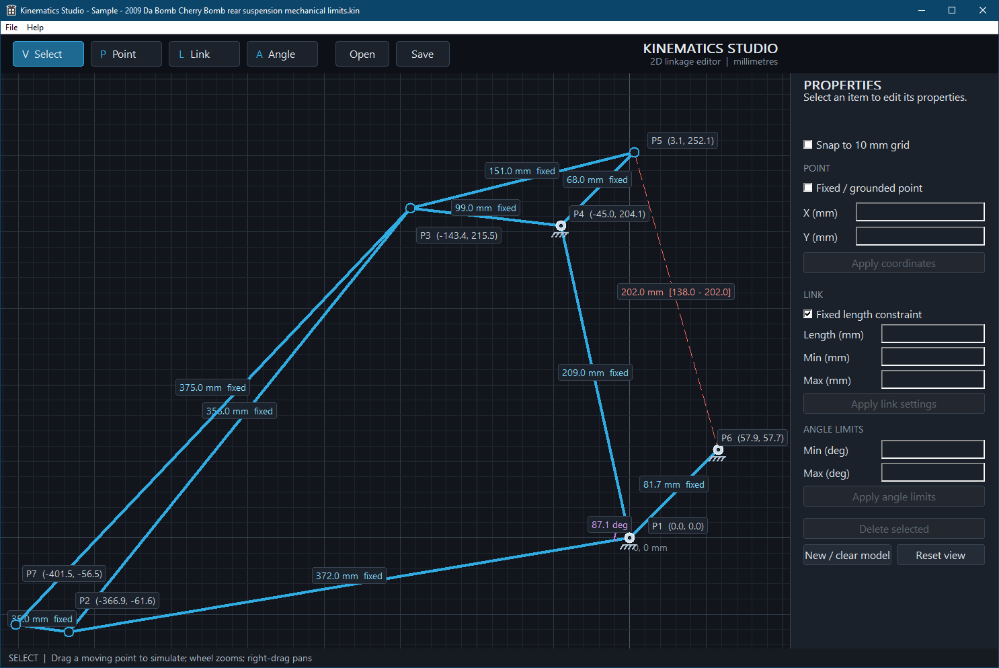

I wanted to simulate and visualise the rear suspension on my bike and see how the shock stroke translates into wheel movement so i made this little program.

# Kinematics Studio

A lightweight 2D linkage simulator for Windows.

Create fixed and moving pivots, connect them with constrained links,
 measure angles, add travel limits and interactively simulate mechanisms 
such as bicycle suspension systems.

